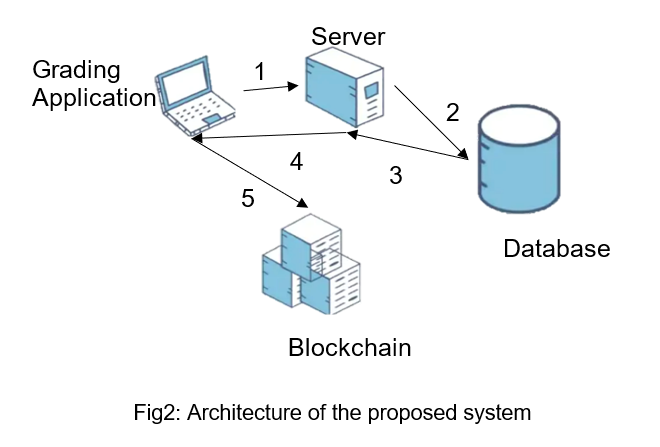

<h1>MITIGATE INSIDER ATTACKS USING BLOCKCHAIN NETWORK</h1>
<h2>Abstract</h2>

Insider attacks are common in applications that rely on centralized databases.Insider threat is the potential for an insider to use their authorized access or understanding of an organization to harm that organization. For Example, They could be a departing employee stockpiling data to get a leg up in their next job, a negligent remote worker connected to an unsecured network, or several other kinds of individuals.
 
Any user with administrative privileges on the Database system has the ability to modify database entries. Here, this issue is addressed by leveraging Blockchain's tamper resistance. Multichain is used to implement and test the solution on an academic grading application. 
The goal of this project is to create a blockchain network and an application over the network to secure every database transaction and to identify attempts to attack a group or organization by individuals who have access to information that isn't available to others.

Keywords: Block chain, Multichain, insider attack, Database.

<h2>Introduction</h2>

Blockchain technology is a sophisticated database mechanism that enables the transparent sharing of information within a business network. Data is stored in blocks that are linked together in a chain in a blockchain database. Because one cannot delete or modify the chain without network consensus, the data is chronologically consistent. All new information that follows that newly added block is compiled into a newly formed block, which is then added to the chain once it is complete.  As a result, blockchain technology can be used to create an immutable ledger for tracking orders, payments, accounts, and other transactions. The system includes mechanisms for preventing unauthorized transaction entries and ensuring consistency in the shared view of these transactions.

However, insider attacks are taking the lead. Once an insider threat has occurred, tracing and obtaining evidence becomes extremely difficult. The attacker is a legitimate user and may be system administrators. As a result, the internal network's security facilities are unable to monitor or prevent such attacks. This paper implements and tests an approach to mitigate insider attacks in blockchain on an academic grading application

In this project Apache’s XAMPP server is used to host the application on localhost and to create the database  in PHPMYADMIN of the local host. The existing framework called Multichain is used to build the  blockchain network. The project is run on an Linux environment

The above figure represents the architecture of the system proposed. The system consists of 4 main components Grading Application, Server, Database and blockchain. 
The application connects to the server with a request to insert/update the data 
The server inserts/updates the data in the database
The database sends ACK to server
Server sends this ACK to the host/application 
The application updates the transaction onto a node in blockchain

<h3>DataBase </h3>

There are 3 tables in our database. They are:

<li>Creds(credential)</li>
<li>Grades</li>
<li>Instructors</li>

<ul>Creds: This table consists of students name, user id , salt and hash values of their credentials. The student's information is entered by the admin.</ul>
<ul>Grades: This table mainly consists of 5 fields.</ul>
<li>User id:This field stores the user id of the student.</li>
<li>Grades: This field contains the grades of the student.</li>
<li>Course: This field specifies the course for the grade.</li>
<li>Identifier:  This field indicates the instructor who provides the grade.</li>
<li>Transaction id: This field holds the value of transaction id in the block chain.</li>

<ul>Instructor: This table contains the information of the instructor. The name of the instructor,   salt and hash values of their credentials.</ul>
<h3>Multichain Stream Functionality</h3>
Stream functionality is provided by the Multichain network, which allows for data insertion and retrieval on the blockchain network. Streams are a natural abstraction for blockchain use cases that focus on general data retrieval, timestamping, and archiving rather than asset transfer. In a MultiChain blockchain, any number of streams can be created, and each stream acts as an independent append-only collection of items.
Streams can be used to implement three different types of databases on a chain: 
<li> key-value database or document store </li>
<li>A time series database that focuses on the ordering of entries </li>
<li>An identity-driven database where entries are classified based on their author.</li>
Here, three streams are created: stream1 for storing database state(transaction id), pubkey stream for storing public key and identifier (instructorID) pairings, and a third for storing instructor-course pairings.

<h3>METHODS</h3>

<h4>SIGNUP and LOGIN</h4>

This application is built with a Python Tkinter-based GUI. Instructors can sign up for the application and then log in. An RSA key pair is generated when they sign up. The Private Key is encrypted with the passcode entered by the instructor and saved on the person's system. The Public Key is transmitted to the server and broadcasted 

<h4>INSERTING QUERY</h4>

An instructor can enter his students' grades in the courses he teaches. The courses taught by a specific instructor are not stored in the database, but rather appear as a transaction on an instructor stream. 
An instructor enters a newline between each space-separated string of a student's userID, course, and grade. When a batch of grades is submitted, each line of grade is digitally signed with the instructor's PrivateKey and sent to the server. The server retrieves the instructor's public key from the public key stream and verifies the signature.

The database is retrieved (ordered by txID) for each grade about to be entered, and each tuple (txID+uid+course+grade+identifier) is concatenated and a hash is obtained.
The current grade is concatenated to this hash (uid+course+grade+identifier) and hashed again. This final hash is then sent to the stream, resulting in a transaction for that grade. It should be noted that the actual implementation is optimized to only query the database once for each group of inserts.

<h4>UPDATING QUERY</h4>

Additionally, instructors can change a student's grade. Updates, unlike Inserts, occur one at a time. When an update is released, the entire database is retrieved and the old grade tuple is deleted. It is now hashed, the new data is concatenated and hashed again (similar to the insert query above), and the transaction is sent to the stream. The old grade and transactionID are then replaced with the new grade and transactionID.

<h3>Detecting an Insider Attack</h3>
A check is performed before each query (SELECT, INSERT, UPDATE) issued to the database to see if the database is consistent with what is present in the Multichain stream.

To obtain the most recent transaction, the stream is queried. The transactionID and corresponding data (a hash) are retrieved. The entire database is now queried, and all grades except the one corresponding to the most recent transactionID are concatenated. A hash is calculated, then the resultant string is concatenated with this leftover grade (uid+course+grade+identifier) and a hash is calculated over the resultant string. If the hash obtained matches the one stored in the stream corresponding to the most recent transaction, the database is consistent; otherwise, it has been accessed illegally, indicating insider access.

A notification in the grading application is displayed that there is a breach detected.

<h2>Results and Discussion</h2>
<ul><h3>Instructor login</h3>

As the instructor logs in, he has the option to either view the grades or enter the grades.
</ul>

<ul><h3>Student login</h3>
Students can login and view their grades. 
.
</ul>

<ul><h3>Detecting insider attacks</h3>
When there is an illegal attempt to modify/change the data, a breach is detected.
.
</ul>

<h2>Commands to implement the project</h2>
<h3>Software to be installed</h3>

Install Apache server

https://vitux.com/ubuntu-xampp/

Install mysql client 

$ sudo apt install mysql-client-core-8.0

<h3>Libraries to be installed</h3>

<ul>sudo apt-get install python3-tk</ul>
<ul>pip3 install pycrypto</ul>

<h3>Installing Multichain</h3>

install kuntsmann multichain (clone their repo)

https://github.com/Kunstmaan/libphp-multichain

Run: $ composer require kunstmaan/libphp-multichain

<h3>Setting up the environment</h3>

Once the Multichain environment is installed, We run the following commands

<ul>create node</ul>

<li>$ multichain-util create <chain_name></li>
<li>$ multichaind <chain_name> -daemon</li>

<ul>activate command line</ul>

<li>$ multichain-cli <chain_name></li>

<ul>Create Streams</ul>
<li>$ create stream stream1 true</li>
<li>$ subscribe stream1</li>
<li>$ create stream pubkey true</li>
<li>$ subscribe pubkey</li>
<li>$ create stream instructor true</li>
<li>$ subscribe instructor</li>

<ul>Verify streams created by</ul>

<li>$ liststreams</li>

<ul>in chain1 run these commands to publish the instructor's courses</ul>
<li>(InstructorID = i and course = cs317)</li>
<li>$ publish instructor i 6373333137</li>

<li>(InstructorID = i and course = cs317)</li>
<li>$ publish instructor i 6373333837</li>

<ul>stop the blockchain node</ul>
<li>$ multichain <chain_name> stop</li>

<h3>Note:</h3>

check multichain.conf file in /home/<user>/.multichain/<chain_name>/multichain.conf file for username and password
for a node to paste it into check.php and signup.php file to connect to blockchain.

$client = new MultichainClient("http://127.0.0.1:&lt;default-rpc-port&gt;", &lt;username&gt;, &lt;password&gt;, 3);

The default json-rpc port will be present 

/home/<user>/.multichain/<chain_name>/params.dat file.
